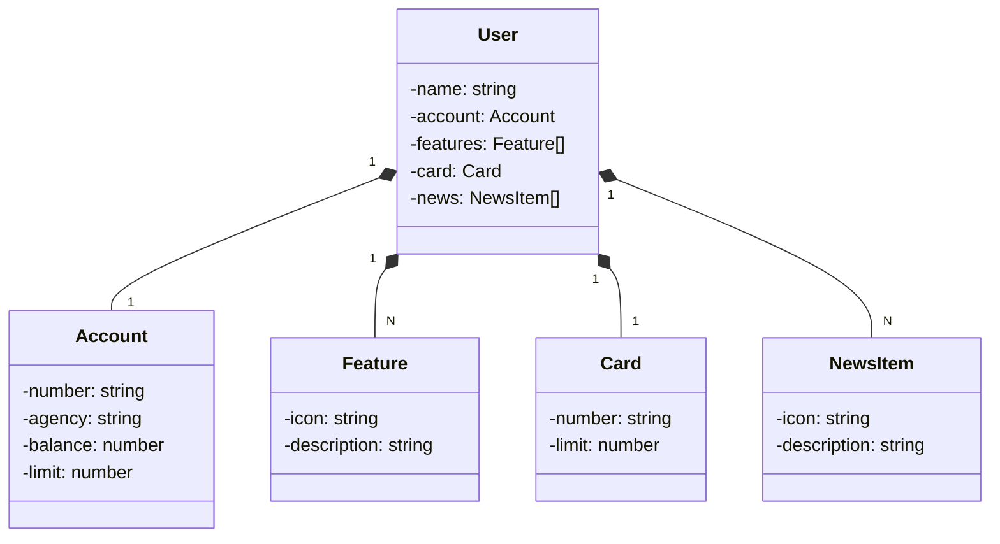

## Bradesco Bootcamp Java

## Diagrama de Classes

```mermaid
classDiagram
  class User {
    -name: string
    -account: Account
    -features: Feature[]
    -card: Card
    -news: NewsItem[]
  }
  class Account {
    -number: string
    -agency: string
    -balance: number
    -limit: number
  }
  class Feature {
    -icon: string
    -description: string
  }
  class Card {
    -number: string
    -limit: number
  }
  class NewsItem {
    -icon: string
    -description: string
  }
  User "1" *-- "1" Account
  User "1" *-- "N" Feature
  User "1" *-- "1" Card
  User "1" *-- "N" NewsItem
```
